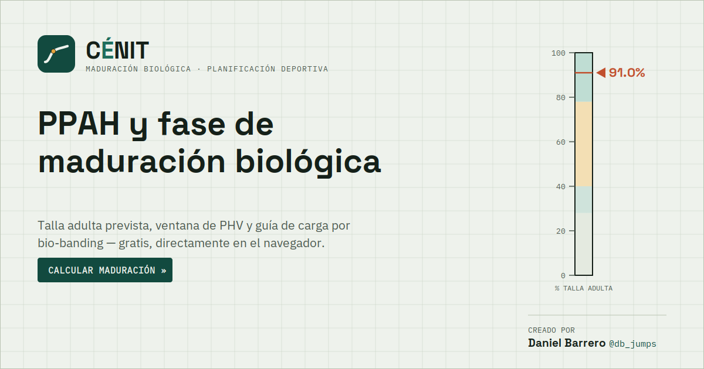

# CÉNIT — Laboratorio de maduración biológica del deportista

Aplicación web de una sola página que estima el **PPAH** (porcentaje de talla adulta predicha) de un/a joven deportista, sitúa su fase respecto al **Pico de Velocidad de Crecimiento (PHV)** y traduce ese resultado en criterios prácticos de carga y *bio-banding*.

🔗 **Pruébala aquí:** https://TU-USUARIO.github.io/cenit-app/ *(sustituye por tu URL real de GitHub Pages)*



## Qué calcula

- **Talla adulta prevista**, mediante la ecuación de **Khamis-Roche** (talla, peso y talla media parental, con coeficientes específicos por sexo y edad en pasos de 0.5 años, de 4.0 a 17.5 años).
- **PPAH** = talla actual del deportista ÷ talla adulta prevista, con su rango de incertidumbre según el error estándar publicado del método (±5.6 cm en chicos, ±4.3 cm en chicas).
- **Fase de maduración**: pre-estirón, inicio del estirón, circa-PHV o post-PHV, con un aviso específico de precaución de carga en la ventana circa-PHV (mayor riesgo de patologías por sobreuso óseo como Osgood-Schlatter o Sever).
- **Talla diana parental (Tanner)** como referencia cruzada independiente.
- **Verificación opcional por velocidad de crecimiento** (cm/año), a partir de una medición anterior.

## Sobre el método

Los umbrales de fase por PPAH se usan en lugar de las ecuaciones de *maturity offset*, que solo son fiables entre los 13 y 15 años y distorsionan sistemáticamente a los maduradores tempranos y tardíos.

Los coeficientes de Khamis-Roche proceden de una reproducción publicada por un tercero (CalcVita), que cita a Khamis HJ, Roche AF. *Pediatrics* 1994;94:504–507, y su erratum de 1995;95(3):457. No han sido cotejados dígito a dígito contra el artículo original, de acceso restringido — se documenta esta limitación directamente dentro de la app.

Esta herramienta **no sustituye** una valoración de un profesional de ciencias del deporte o medicina, ni la comparación del PPAH frente a una referencia poblacional local mediante puntuaciones z.

## Uso

Es una app estática: no requiere instalación, servidor ni conexión a base de datos. Todo el cálculo ocurre en el navegador del usuario; ningún dato introducido se envía a ningún sitio.

Para desplegarla, sube todos los archivos del repositorio (deben quedar en la misma carpeta, ya que las rutas son relativas) y activa GitHub Pages, o ábrela directamente como archivo local.

## Estructura del repositorio

```
index.html            App principal
app-icon.svg           Icono maestro de CÉNIT (vectorial)
icon-512.png / icon-192.png / apple-touch-icon.png / favicon-32.png   Iconos para móvil/PWA
manifest.json           Manifest web (para "Añadir a pantalla de inicio")
og-image.png             Imagen de vista previa al compartir el enlace
db-badge.png / db-badge@2x.png    Insignia de crédito del autor
```

## Licencia

Sin licencia explícita de código abierto: el uso previsto es a través del enlace público de la app. Si quieres reutilizar o adaptar el código, contacta antes con el autor.

## Autor

**Daniel Barrero** — [@db_jumps](https://www.instagram.com/db_jumps/)
